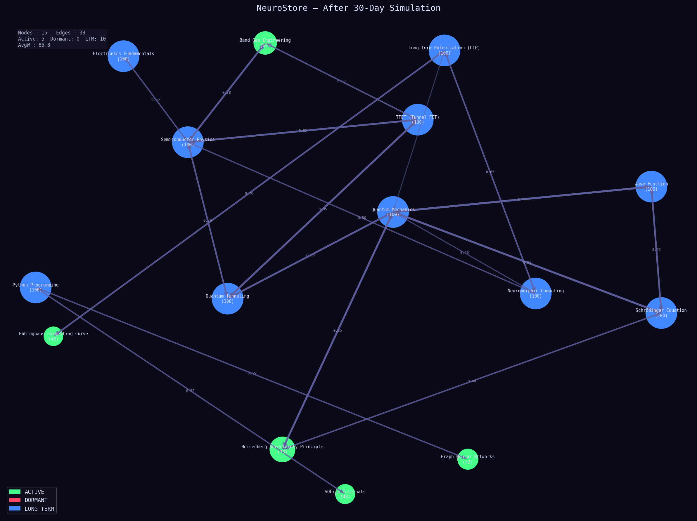
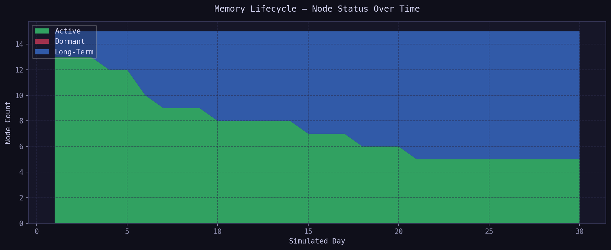
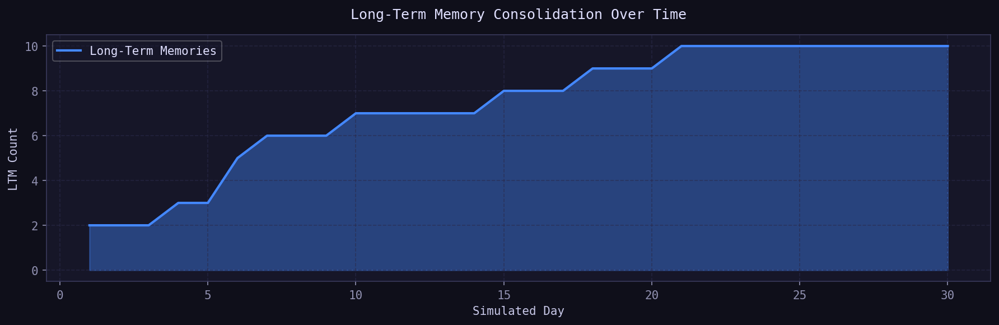
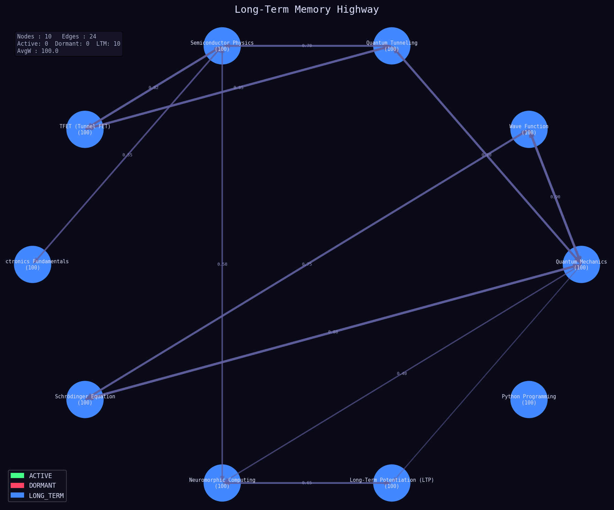
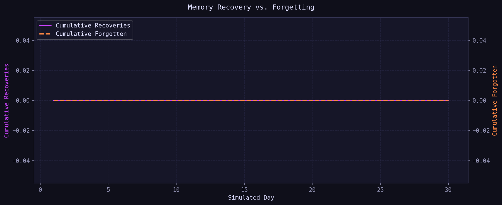
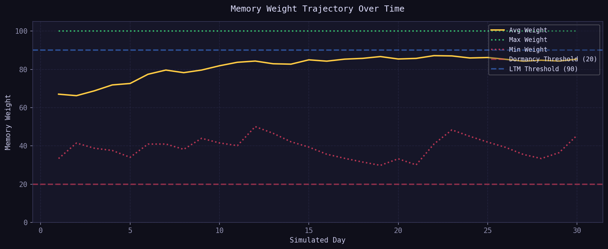
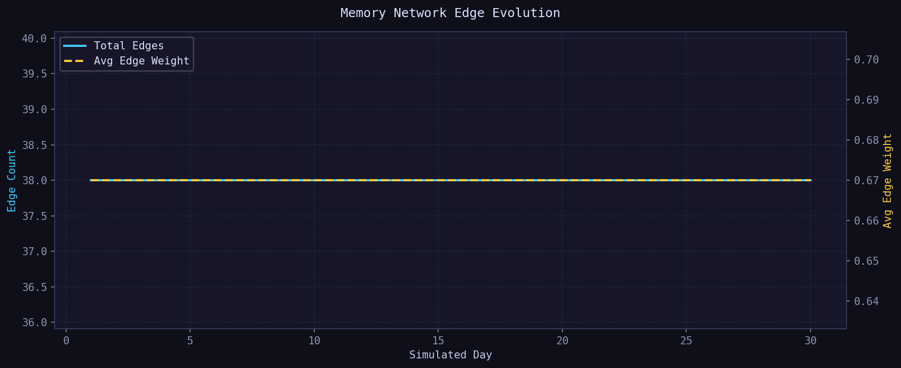
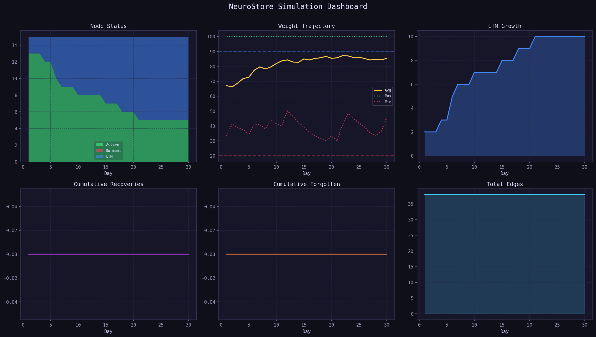

# NeuroStore

> **A biologically-inspired memory storage architecture that simulates reinforcement, forgetting, recovery, and associative recall using weighted memory graphs.**

NeuroStore is an experimental storage and retrieval system inspired by the way biological memory operates. Unlike traditional databases that treat information as static records, NeuroStore models memories as dynamic entities that can strengthen, weaken, become dormant, recover through association, and eventually consolidate into long-term memory.

The project explores whether principles observed in human memory can be translated into a computational architecture for intelligent information storage and retrieval.

---

## Authors

- Aditya Bhardwaj
- Rishika Kapil

Independent Research Project (2026)

---

## Project Status

Research Prototype / Proof of Concept

---

## Research Question

Can biologically-inspired memory mechanisms such as reinforcement, forgetting, and associative recall improve information organization compared to traditional static storage systems?

---

# Table of Contents

* Overview
* Motivation
* Core Concepts
* System Architecture
* Memory Lifecycle
* Features
* Project Structure
* Installation
* Usage
* Example Workflow
* Memory Retrieval Process
* Analytics & Visualization
* Research Applications
* Current Limitations
* Future Work
* Contributing
* License

---

# Overview

NeuroStore is not intended to be a neuroscience simulator.

Instead, it is a proof-of-concept memory architecture that borrows several high-level ideas from biological cognition:

* Memory reinforcement through recall
* Memory decay through neglect
* Associative memory networks
* Long-term memory consolidation
* Recovery of forgotten memories
* Dynamic memory importance

Information is stored as interconnected nodes within a weighted graph structure.

Each memory contains:

* Content
* Importance score (weight)
* Relationships with other memories
* Decay properties
* Retrieval history

Over time, memories evolve based on usage patterns.

---

# Motivation

Modern storage systems are excellent at preserving information but do not model how information changes in importance over time.

Traditional databases:

* Store data permanently
* Treat all records equally
* Require explicit deletion
* Lack natural associations

Human memory behaves differently.

Memories:

* Strengthen when recalled
* Fade when ignored
* Form associations
* Become easier to access through repetition
* Can sometimes be recovered after being forgotten

NeuroStore explores whether these characteristics can be represented computationally using graph structures and adaptive weighting mechanisms.

---

# Core Concepts

## Memory Node

A memory is represented as a graph node.

Example:

```json
{
    "id": "M001",
    "title": "Quantum Mechanics",
    "content": "Introduction to wave functions",
    "weight": 65,
    "status": "ACTIVE"
}
```

Each memory contains:

| Property      | Description          |
| ------------- | -------------------- |
| ID            | Unique identifier    |
| Title         | Memory label         |
| Content       | Stored information   |
| Weight        | Importance level     |
| Status        | Current memory state |
| Created At    | Creation timestamp   |
| Last Accessed | Most recent recall   |

---

## Weighted Associations

Memories are connected through weighted edges.

Example:

```text
Quantum Mechanics
      |
      | 0.82
      v
Wave Function
```

Higher weights indicate stronger associations.

---

## Reinforcement

When a memory is recalled:

```text
Weight += Reinforcement Factor
```

Repeated access strengthens memory retention.

---

## Decay

Memories naturally lose significance over time.

```text
Weight -= Decay Function
```

The rate of decay depends on:

* Current weight
* Memory status
* Time since last recall

---

## Long-Term Consolidation

Highly reinforced memories enter a dedicated long-term memory structure.

Characteristics:

* Minimal decay
* Faster retrieval
* Stronger associations

---

## Associative Recall

Recalling one memory partially activates related memories.

Example:

```text
TFET
 |
 +--> Semiconductor Physics
 |
 +--> Quantum Tunneling
 |
 +--> Electronics
```

This mimics associative memory retrieval.

---

# System Architecture

```text
                 User Input
                      |
                      v
              Memory Manager
                      |
                      v
              Graph Structure
                      |
     --------------------------------
     |              |              |
     v              v              v

 Reinforcement   Decay Engine   Recovery
     |                              |
     --------------------------------
                      |
                      v
             Long-Term Highway
                      |
                      v
                SQLite Storage
```

The architecture separates memory behavior from storage persistence.

SQLite handles storage.

Graph structures handle cognition-inspired behavior.

---

# Memory Lifecycle

## Stage 1 — Creation

A memory is added to the system.

```text
Status: ACTIVE
Weight: 40
```

---

## Stage 2 — Reinforcement

Repeated recall increases weight.

```text
40 → 55 → 72 → 89
```

---

## Stage 3 — Consolidation

Once the threshold is reached:

```text
Weight ≥ 90
```

The memory becomes:

```text
LONG_TERM
```

---

## Stage 4 — Neglect

If not recalled:

```text
Weight ↓
```

---

## Stage 5 — Dormancy

Below threshold:

```text
Weight < 20
```

Status changes to:

```text
DORMANT
```

The memory is hidden but not deleted.

---

## Stage 6 — Recovery

Associated memories can reactivate dormant memories.

```text
DORMANT → ACTIVE
```

Connections are restored and retention increases.

---

# Features

## Graph-Based Storage

Information stored as interconnected nodes.

## Memory Reinforcement

Recall strengthens retention.

## Adaptive Forgetting

Unused memories gradually weaken.

## Dormancy

Memories become inactive instead of being deleted.

## Memory Recovery

Forgotten memories can be reactivated.

## Long-Term Memory Highway

Strong memories are consolidated.

## Analytics Dashboard

Tracks memory evolution.

## Visualization Tools

Generate network diagrams and statistics.

---

# Project Structure

```text
neurostore/

├── main.py
├── memory/
│   ├── node.py
│   ├── graph.py
│   ├── decay.py
│   ├── reinforcement.py
│   ├── recovery.py
│   └── highway.py
│
├── database/
│   └── db.py
│
├── analytics/
│   ├── metrics.py
│   └── charts.py
│
├── visualization/
│   └── graph_view.py
│
├── tests/
├── data/
├── README.md
└── requirements.txt
```

---

# Screenshots

## Memory Graph



## Memory Lifecycle



## Long-Term Memory Growth



## Long-Term Memory Highway



## Recovery vs Forgetting



## Weight Trajectory



## Edge Evolution



## Simulation Dashboard


---

# Installation

Clone the repository:

```bash
git clone https://github.com/pixeleskadi/neurostore.git

cd neurostore
```

Create virtual environment:

```bash
python -m venv venv
```

Activate environment:

Windows:

```bash
venv\Scripts\activate
```

Linux/macOS:

```bash
source venv/bin/activate
```

Install dependencies:

```bash
pip install -r requirements.txt
```

---

# Usage

Add a memory:

```bash
python main.py add
```

Recall a memory:

```bash
python main.py recall
```

Run simulation:

```bash
python main.py simulate
```

Generate analytics:

```bash
python main.py stats
```

Visualize memory graph:

```bash
python main.py visualize
```

---

# Example Workflow

1. Add memory

```text
Title:
Quantum Mechanics
```

2. Add related memory

```text
Wave Function
```

3. Create association

```text
Quantum Mechanics → Wave Function
```

4. Recall Quantum Mechanics repeatedly

5. Observe increasing weight

6. Watch memory enter long-term storage

7. Simulate neglect

8. Observe dormancy

9. Trigger recovery via related memories

---

# Memory Retrieval Process

Traditional databases:

```text
Query → Record
```

NeuroStore:

```text
Query
  ↓
Memory Node
  ↓
Associated Nodes
  ↓
Activation Propagation
  ↓
Contextual Retrieval
```

This allows information to be retrieved through relationships rather than exact matches alone.

---

# Analytics & Visualization

NeuroStore tracks:

* Active memories
* Dormant memories
* Long-term memories
* Average memory weight
* Recovery events
* Forgetting events
* Graph density
* Retrieval efficiency

Visualization outputs include:

* Network graphs
* Memory status maps
* Retention trends
* Consolidation statistics

---

# Research Applications

Potential research directions include:

* Cognitive-inspired storage systems
* Associative memory retrieval
* Knowledge graph evolution
* Low-power information systems
* Educational memory modeling
* Intelligent note-taking systems
* Neuromorphic software architectures

---

# Current Limitations

This project is an experimental proof of concept.

Current limitations include:

* Simplified memory model
* Fixed decay parameters
* No biological validation
* No semantic understanding
* No neural computation
* No embedding-based similarity

The system is inspired by memory behavior but does not claim to accurately model human cognition.

---

## Disclaimer

NeuroStore is inspired by concepts from cognitive science and neuroscience.

It is not intended to be an accurate simulation of the human brain and should be viewed as an experimental storage architecture inspired by memory-related behaviors.

---


# Future Work

## Small Local Language Models

Automatic memory categorization and linking.

## Semantic Embeddings

Similarity-based memory formation.

## Vector Database Integration

Comparison with modern retrieval systems.

## Raspberry Pi Deployment

Low-power memory architecture experiments.

## SSD-Aware Optimization

Investigating biologically-inspired storage behavior on flash memory systems.

## Adaptive Decay Models

Decay functions derived from empirical memory research.

## Research Publication

Benchmarking NeuroStore against traditional retrieval systems and vector databases.

---

# Contributing

Contributions, experiments, and research collaborations are welcome.

Areas of interest include:

* Graph optimization
* Retrieval algorithms
* Cognitive architectures
* Embedded systems
* Data analytics
* Memory modeling

Please open an issue or submit a pull request.

---

# License

MIT License

---

## Citation

If you use NeuroStore in research or academic work, please cite:

```text
NeuroStore: A Biologically-Inspired Memory Storage Architecture
Author(s): Aditya Bhardwaj, Rishika Kapil
Year: 2026
```

---

*"Exploring memory as a dynamic network rather than a static database."*
